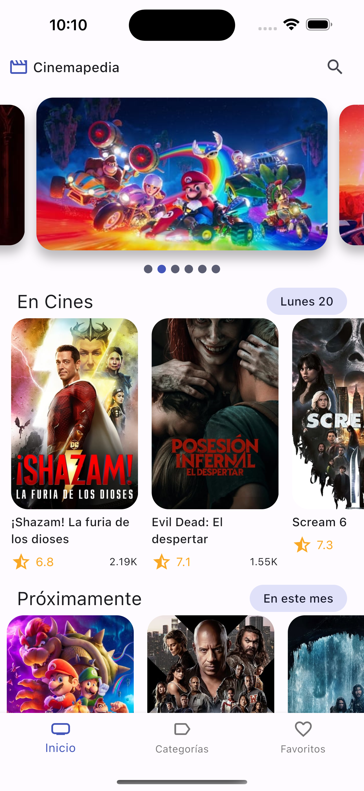
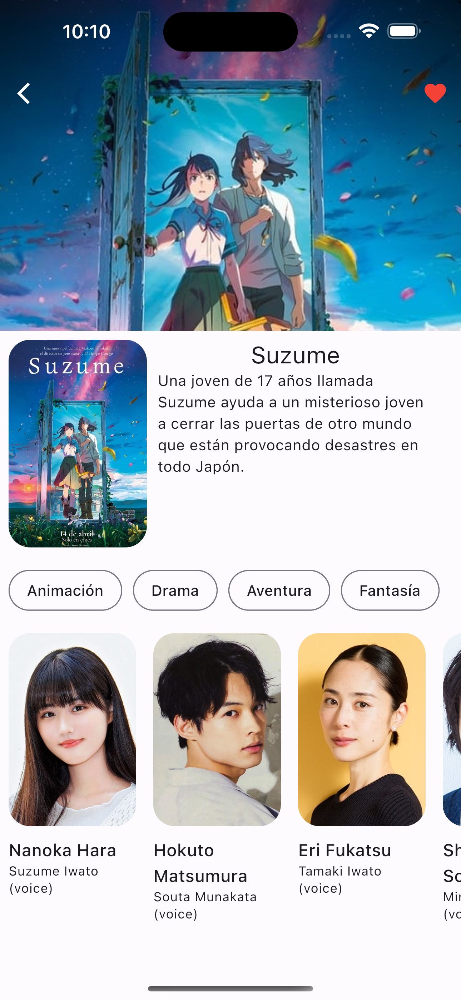
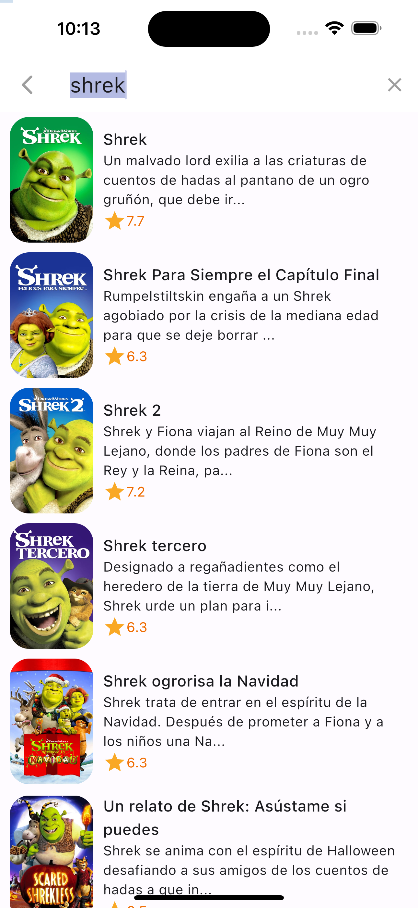

# fl_cinemapedia_app
Aplicacion desarrollada con Flutter haciendo uso de la api de TheMovieDB y Clean Code en el proyecto

## Deploy
1. Copiar el .env.template y renombrarlo a .env
2. Cambiar las variables de entorno (The Movie DB) 
   https://developers.themoviedb.org/3/getting-started/introduction
3. Cambios en la entidad, hay que ejecutar el comando
```
flutter pub run build_runner build
```
<hr/>
<h3>Screenshots</h3>
<div>
  
  
  
</div>

